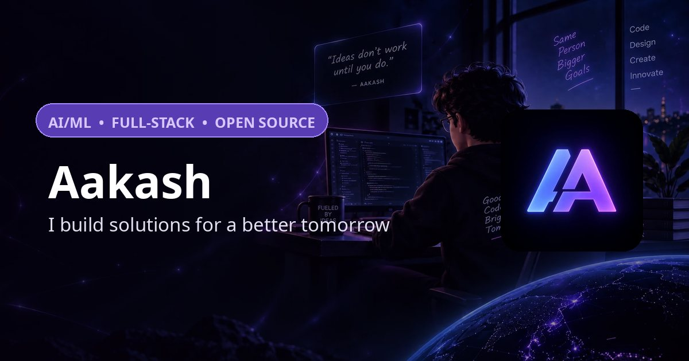

# Aakash — Portfolio



**Live demo:** [aakash-portfolio-vert.vercel.app](https://aakash-portfolio-vert.vercel.app) · Custom domain `aakashgugilla.is-a.dev` activates once the [is-a.dev registration PR](https://github.com/is-a-dev/register/pull/54908) merges.

> Aakash — I build solutions for a better tomorrow. A cinematic, single-page developer portfolio built with Next.js 16, featuring full-bleed video backgrounds, scroll-reveal motion, and a production-grade contact API.

## Tech stack

- **Framework:** Next.js 16 (App Router, Turbopack) + TypeScript
- **Styling:** Tailwind CSS v4
- **Motion:** framer-motion (with `MotionConfig reducedMotion="user"`)
- **Contact API:** Resend + Zod validation + in-memory rate limiting
- **Deployment:** Vercel

## Features

- **Six sections** — Hero, About, Projects (3D tilt cards + filters), Skills (category tabs), Contact, Footer
- **Contact API** (`POST /api/contact`) — Zod-validated, HTML-escaped emails via Resend, 5 req/min/IP sliding-window rate limit, honeypot-free with in-flight dedupe on the client
- **Accessibility** — global `:focus-visible` outline, `aria-expanded` nav toggle, `role="status"` form feedback, `aria-hidden` decorative videos, reduced-motion pauses all background videos
- **SEO** — canonical + Open Graph + Twitter cards, `Person`/`WebSite` JSON-LD, `robots.ts`, `sitemap.ts`, branded favicon/apple-icon/manifest
- **Performance** — 1080p audio-stripped background videos (−86% bytes), WebP posters, `preload="metadata"`, mobile poster fallbacks that skip video entirely

## Getting started

```bash
npm install
npm run dev        # http://localhost:3000
```

Other scripts:

```bash
npm run lint       # ESLint
npm run typecheck  # tsc --noEmit
npm run test       # Vitest unit tests
npm run build      # production build
```

## Environment variables

Copy `.env.example` and fill in (server-side only — never expose with a `NEXT_PUBLIC_` prefix):

| Variable | Purpose |
| --- | --- |
| `RESEND_API_KEY` | Resend API key for sending contact emails |
| `CONTACT_EMAIL` | Inbox that receives contact submissions |
| `RESEND_FROM` | Optional From address (falls back to `onboarding@resend.dev`) |

## Deployment

Pushes to `master` run the [CI workflow](.github/workflows/ci.yml) (lint → typecheck → build). Production deploys run on Vercel.

> **Note:** if the production alias ever serves a stale build, re-pin it:
> `npx vercel alias set <latest-deployment-url> aakash-portfolio-vert.vercel.app`

## Links

- [GitHub](https://github.com/Gugilla-Aakash)
- [LinkedIn](https://www.linkedin.com/in/gugilla-aakash)
- [Resume (PDF)](https://aakash-portfolio-vert.vercel.app/resume.pdf)
